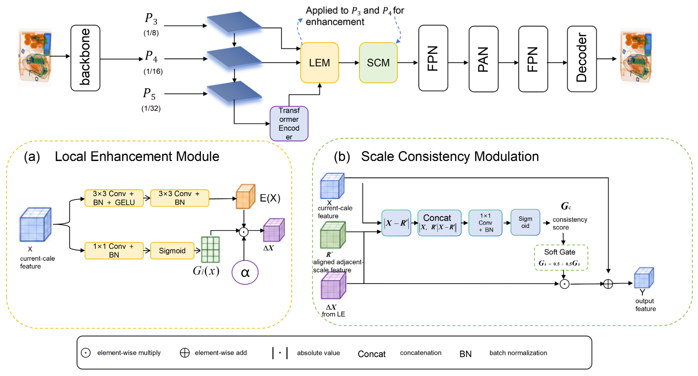

# SCRM-DETR

Official implementation of **SCRM-DETR: Scale-Consistent Residual Modulation for Prohibited Item Detection in X-Ray Images**.

> Paper status: under preparation for submission. Code and experiment configurations are being released progressively.

## Overview

SCRM-DETR is built on RT-DETR for X-ray prohibited-item detection. Its core component, **Scale-Consistent Residual Modulation (SCRM)**, separates local enhancement generation from cross-scale reliability verification.

SCRM contains two complementary modules:

- **LEM (Local Enhancement Module):** generates a candidate local enhancement residual.
- **SCM (Scale-Consistency Modulation):** estimates how reliably that residual should be written back using the current feature, an aligned adjacent-scale reference, and their explicit discrepancy.

A key design choice is that the adjacent-scale feature is used as **reliability evidence rather than directly injected feature payload**.

> **Implementation note:** the released code retains some historical internal names such as `SCXLCEBlock`, `SCXLCESoftBlock`, and `sc_xlce_soft`. These correspond to the SCRM implementation described in the paper.

## Method

For a current-scale feature (X), LEM first produces an enhanced representation (X_e) and candidate residual

[
\Delta X = X_e - X.
]

SCM aligns an adjacent-scale reference (R) to obtain (R'), and models

[
[X, R', |X-R'|]
]

to estimate a consistency gate. The candidate residual is then written back through soft modulation:

[
Y = X + \alpha G_s \odot \Delta X.
]

For the final HiXray configuration,

[
G_s = 0.5 + 0.5G_c.
]

SCRM is applied to the P3 and P4 feature levels of the RT-DETR hybrid encoder.

## Framework

<p align="center">
  
</p>


## Highlights

- Local enhancement and reliability verification are explicitly separated.
- Adjacent-scale information is used as evidence for residual modulation instead of direct feature payload.
- Explicit cross-scale discrepancy ( |X-R'| ) is included in the reliability estimator.
- The same modulation mechanism is evaluated on both HiXray and PIDRay.
- Controlled ablations are provided for LEM-only, hard gating, no-discrepancy, and cross-scale-payload variants.

## Installation

Clone the repository:

```bash
git clone https://github.com/tk15579314-ux/SCRM-DETR.git
cd SCRM-DETR
```

Install the Python dependencies:

```bash
pip install -r requirements.txt
```

The environment used for the reported experiments was:

```text
Python  3.10.20
PyTorch 2.12.0.dev20260407+cu128
CUDA    12.8
```

See [ENVIRONMENT.md](ENVIRONMENT.md) for additional notes.

## Dataset Preparation

This repository does **not** redistribute HiXray or PIDRay. Please obtain the datasets from their official sources and follow their respective licenses and terms of use.

Expected HiXray layout:

```text
dataset/hixray/
├── images/
│   ├── train/
│   └── val/
└── annotations/
    ├── instances_train.json
    └── instances_val.json
```

Expected PIDRay layout used by the released configs:

```text
dataset/
├── pidray_yolo/
│   └── images/
│       ├── train/
│       └── val/
└── pidray/
    └── annotations/
        ├── instances_train.json
        └── instances_val.json
```

## Training

### HiXray — SCRM-DETR with R50VD

```bash
python tools/train.py \
  -c configs/rtdetr/rtdetr_r50vd_6x_hixray_sc_xlce_soft.yml \
  --amp
```

### HiXray — SCRM-DETR with R34VD

```bash
python tools/train.py \
  -c configs/rtdetr/rtdetr_r34vd_6x_hixray_sc_xlce_soft.yml \
  --amp
```

### PIDRay — final SCRM configuration

```bash
python tools/train.py \
  -c configs/rtdetr/rtdetr_r50vd_6x_pidray_scrm_final_b030_a050.yml \
  --amp
```

## Evaluation

Evaluation is performed with the same training entry point using `--test-only` and a checkpoint supplied through `-r`:

```bash
python tools/train.py \
  -c configs/rtdetr/rtdetr_r50vd_6x_hixray_sc_xlce_soft.yml \
  -r /path/to/checkpoint.pth \
  --test-only
```

## Inference

Single-image inference is available through `tools/infer.py`:

```bash
python tools/infer.py \
  -c configs/rtdetr/rtdetr_r50vd_6x_hixray_sc_xlce_soft.yml \
  -r /path/to/checkpoint.pth \
  -f /path/to/image.jpg \
  -d cuda:0 \
  --output-dir output/vis
```

## Main Results

### HiXray

| Model | Backbone | AP | AP50 | AP75 | APm | APl |
|---|---|---:|---:|---:|---:|---:|
| RT-DETR | R50VD | 49.58 | 83.66 | 53.82 | 29.14 | 50.41 |
| **SCRM-DETR** | R50VD | **50.64** | 83.53 | **55.29** | **30.70** | **50.79** |
| RT-DETR | R34VD | 49.92 | 81.62 | 55.26 | 29.55 | 49.68 |
| **SCRM-DETR** | R34VD | **50.46** | **82.22** | **55.73** | **30.36** | **51.26** |

With R50VD, SCRM-DETR improves the RT-DETR baseline by **+1.07 AP** and **+1.47 AP75**.

### PIDRay

| Model | AP | AP50 | AP75 | APs | APm | APl |
|---|---:|---:|---:|---:|---:|---:|
| RT-DETR | 67.10 | 79.07 | 73.03 | 13.01 | 55.82 | 65.71 |
| **SCRM-DETR** | **67.16** | **79.16** | **73.15** | **14.22** | **56.82** | 65.53 |

## Ablation Study on HiXray

| Variant | AP | AP50 | AP75 | APm | APl |
|---|---:|---:|---:|---:|---:|
| Baseline RT-DETR | 49.58 | 83.66 | 53.82 | 29.14 | 50.41 |
| LEM only | 48.20 | 82.85 | 50.65 | 29.68 | 48.48 |
| Hard residual gating | 48.55 | 83.51 | 51.28 | 29.58 | 49.07 |
| w/o explicit discrepancy | 49.20 | 83.86 | 52.24 | 30.44 | 49.65 |
| Cross-scale payload | 49.06 | 83.74 | 52.11 | 29.94 | 49.26 |
| **Full SCRM** | **50.64** | 83.53 | **55.29** | **30.70** | **50.79** |

## Complexity

| Model | Params (M) | GFLOPs | AP |
|---|---:|---:|---:|
| RT-DETR | 33.03 | 100.28 | 49.58 |
| SCRM-DETR | 35.91 | 123.35 | 50.64 |

## Released Configurations

Main configurations:

```text
configs/rtdetr/
├── rtdetr_r50vd_6x_hixray.yml
├── rtdetr_r50vd_6x_hixray_sc_xlce_soft.yml
├── rtdetr_r34vd_6x_hixray.yml
├── rtdetr_r34vd_6x_hixray_sc_xlce_soft.yml
├── rtdetr_r50vd_6x_pidray.yml
├── rtdetr_r50vd_6x_pidray_sc_xlce_soft.yml
└── rtdetr_r50vd_6x_pidray_scrm_final_b030_a050.yml
```

Controlled ablations:

```text
configs/rtdetr/
├── rtdetr_r50vd_6x_hixray_xlce.yml
├── rtdetr_r50vd_6x_hixray_sc_xlce_hard_residual.yml
├── rtdetr_r50vd_6x_hixray_sc_xlce_soft_no_diff.yml
└── rtdetr_r50vd_6x_hixray_sc_xlce_soft_payload.yml
```

## Repository Structure

```text
SCRM-DETR/
├── assets/          # framework / visualization assets
├── configs/         # HiXray, PIDRay, and ablation configs
├── docs/            # release notes and open-source checklist
├── scripts/         # experiment shell scripts
├── src/             # RT-DETR + SCRM implementation
├── tools/           # training, inference, and visualization tools
├── ENVIRONMENT.md
├── LICENSE
├── README.md
└── requirements.txt
```

## Model Zoo

The following EMA checkpoints correspond to the reported results. Download them from the [v0.1.0 release](https://github.com/tk15579314-ux/SCRM-DETR/releases/tag/v0.1.0).

| Model | Dataset | AP | AP75 | Checkpoint |
|---|---|---:|---:|---|
| SCRM-DETR-R50VD | HiXray | 50.64 | 55.29 | [Download](https://github.com/tk15579314-ux/SCRM-DETR/releases/download/v0.1.0/scrm_detr_r50vd_hixray.pth) |
| SCRM-DETR-R34VD | HiXray | 50.46 | 55.73 | [Download](https://github.com/tk15579314-ux/SCRM-DETR/releases/download/v0.1.0/scrm_detr_r34vd_hixray.pth) |
| SCRM-DETR-R50VD | PIDRay | 67.16 | 73.15 | [Download](https://github.com/tk15579314-ux/SCRM-DETR/releases/download/v0.1.0/scrm_detr_r50vd_pidray.pth) |

## Acknowledgements

This project is built upon the open-source [RT-DETR](https://github.com/lyuwenyu/RT-DETR) implementation. We thank the RT-DETR authors and contributors for their work.

## License

This repository follows the **Apache License 2.0**. See [LICENSE](LICENSE).

## Citation

Citation information will be added after the paper metadata is finalized.
